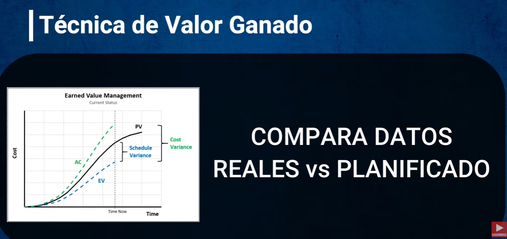
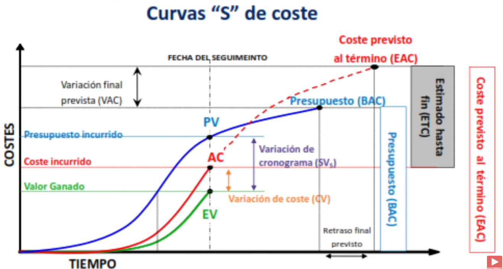
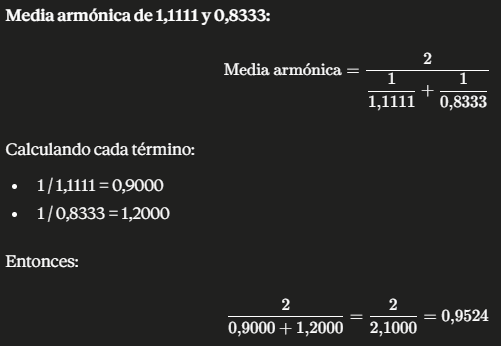

# AI_PROCESS.md

Documento de proceso de la prueba técnica **Ingeniero de Desarrollo — Trycore Colombia**.

Registro vivo: se escribe **durante** el desarrollo, no al final. Cada prompt se transcribe en el mismo turno
en que ocurre, textualmente y sin parafrasear.

- **Repositorio:** https://github.com/afvegac/ProjectEVMTryCore
- **Inicio del ejercicio:** 27 de julio de 2026

---

## 1. Herramientas de IA utilizadas

| Herramienta | Uso |
|---|---|
| **Claude Code (Opus 5)** en terminal | Herramienta principal. Aprendizaje de EVM, diseño de arquitectura, implementación, pruebas y documentación. |

**Por qué esta herramienta:** corre dentro de la terminal con acceso directo al sistema de archivos y a Git, así que trabaja sobre el repositorio real en lugar de sobre fragmentos copiados y pegados como otras IA, por ejemplo tuve la oportunidad de trabajar con chatGPT, anteriormente tenia licencia de Cursor y en APAP trabajan con Copilot, aun asi siempre me ha gustado mas Claude porque puedo tener una conversación mas fluida, entiende y trabaja bajo contextos y no bajo preguntas aisladas.
Puntualmente para este desarrollo es importate concretamente por dos razones: el historial de Git es parte calificada de la entrega, y este
documento exige registrar prompts en orden cronológico —algo que se sostiene mucho mejor cuando la conversación y el código viven en el mismo lugar.

**Otros Recursos Usados:** Leí foros para entender el contexto, ya que de gestión de proyectos desconocía un poco, y el concepto de EVM era completamente nuevo para mí. Luego de ver foros y entender un poco más, decidí buscar videos más detallados en YouTube, así como videos con ejemplos claros y ejercicios.

Después de eso, decidí tener una conversación con Claude para aclarar las dudas que tenía respecto a los cálculos y conceptos. Ya para finalizar, inicié con el contexto sobre el repositorio git creado previamente en el que iba a empezar a trabajar, para que Claude ya tuviera contexto sobre el tema de gestión de proyectos.

**Técnica de Valor Ganado:** 
https://www.youtube.com/watch?v=zhoji7SyWXA

---

## 2. Registro cronológico de prompts

Transcripción textual, sin resumir ni corregir redacción.

### Prompt 1

> Vamos a iniciar a hacer un desarrollo, es una aplicacion que permita gestionar proyectos y sus activiaddes, y que calcule automaticamente los indicadores de valor ganado. Practicamente vamos a una app para poder saber el estado de nuestro proyecto en cualquier momento y con eso vamos a poder tomar desiciones de manera temprana, con la tecnica de valor ganado TECNICA EVM. Quiero que me expliques un poco que es esa tecnica, como se usa y como la podemos aplicar, yo ya estuve viendo videos y tengo claro el uso. pero lo hago para que tu enfoques y trabajemos sobre el mismo conocimiento.

**Respuesta de la IA:** explicación completa de EVM: las tres variables base (PV, EV, AC), los métodos de
acreditación del avance, variaciones (CV, SV), índices (CPI, SPI), pronósticos (EAC, ETC, VAC, TCPI),
Earned Schedule, y un ejemplo numérico. Cerró proponiendo un cuestionario sobre stack y alcance.

### Prompt 2

> Te compartire un documento, quiero que lo analises y entiendas por completo, la idea es primero que podamos trabajar la arquitectura y empezar a hacer lo que dice el documento. Ya tenemos el proyecto con git C:\Users\VICTUS\source\Projects Vega\ProjectEVMTryCore es el repo en el que nos encontramos trabajando. El documento referencia esta C:\Users\VICTUS\Downloads/Ingeniero de Desarrollo — Trycore Colombia (2).pdf

**Respuesta de la IA:** lectura del PDF y replanteamiento del encuadre. Identificó que el modelo EVM pedido
es más simple que el estándar PMI completo (sin línea de tiempo, sin Earned Schedule, 8 indicadores), que el
peso de la evaluación está en el video y en este documento, y que `AI_PROCESS.md` exige prompts textuales
desde el inicio.

**Decisiones tomadas en este punto** (respuestas a preguntas de la IA):

| Pregunta | Decisión |
|---|---|
| Backend | Node + NestJS |
| Frontend | Angular |
| Base de datos | PostgreSQL con docker-compose |
| Alcance | Estricto al documento |

### Prompt 3

> Quiero que tal como dice el documento trabajemos le estructura de ramas feature por cada funcionalidad, no vas a hacer commits sin tener mi aprobación y suipervición. Adicional el archivo AI_PROCESS.md debemos crearlo desde el principio ya que como entregable este debe tener la documentación y cada uno de los prompt que trabajamos.

**Respuesta de la IA:** ajustó el plan para mover `AI_PROCESS.md` de la última rama a la primera, como
archivo vivo actualizado en cada rama, y añadió la regla de aprobación previa a los commits.

### Prompt 4

> analisemos bien las formulas para ver que estan claras y no vamos a hacer reprocesos

**Respuesta de la IA:** análisis fórmula por fórmula, con caso de referencia calculado a mano, política de
divisiones indefinidas, cuatro invariantes matemáticas y demostración numérica de por qué no se pueden
promediar los índices al consolidar. Detalle en la sección 3.

**Decisión tomada en este punto:**

| Pregunta | Decisión |
|---|---|
| Estado cuando un índice es indefinido pero CV/SV sí informa | `NOT_AVAILABLE` + nota explicativa (código de razón) |

### Prompt 5

> ls .claude/skills

**Respuesta de la IA:** verificó que no existen directorios de skills ni en el proyecto ni a nivel de usuario.

### Prompt 6

> para el front usa el skill frontend-design.

**Respuesta de la IA:** confirmó que esa skill no existe (`Unknown skill: frontend-design`) y propuso
`dataviz` como sustituto real para la gráfica PV/EV/AC, las tarjetas de indicadores y los semáforos
accesibles, a cargar en la rama del dashboard.

### Prompt 7

> Haz el manejo de git tu, lo unico que va a requerir mi autorizacion y revision seran los commit

**Respuesta de la IA:** acotó la regla del Prompt 3: la IA maneja ramas, merges, push y PRs de forma
autónoma; solo los commits requieren autorización y revisión.

### Prompt 8

> dale, aprueba el commit sin las dos ultimas lineas

**Contexto:** la IA propuso el mensaje del primer commit incluyendo las líneas de atribución
`Co-Authored-By: Claude Opus 5` y `Claude-Session`. Se aprobó el commit sin ellas.

**Respuesta de la IA:** ejecutó el commit `9ddaa56` con 37 archivos, publicó `develop` y
`feature/project-setup`, y abrió el Pull Request #1 hacia `develop`.

### Prompt 9

> veo que en la funcion classifyIndex estas recibiendo 3 parametros del mismo tipo, eso nos podria jugar en contra ya que si por alguna razón se cambia el orden de llamado o la firma vamos a realizar los calculos incorrectos, quiero que dejes un solo objteo y ajustes las demas funciones o logica que use esos mismos parametros.

**Contexto:** El resultado llegó al repositorio dentro del commit `edcf315`, hecho directamente por el
candidato.

**Resultado:** la IA había escrito una firma con tres parámetros del mismo tipo genérico en fila:

```ts
classifyIndex(index, aboveNeutral, atNeutral, belowNeutral)
```

Intercambiar dos de ellos compila sin una sola advertencia y clasifica mal **todas** las actividades en
silencio; si las pruebas se hubieran escrito contra ese mismo orden equivocado, tampoco lo habrían
detectado. El ajuste los agrupa en un objeto nombrado, donde el error deja de ser posible:

```ts
classifyIndex(index, {
  above: CostStatus.UnderBudget,
  at:    CostStatus.OnBudget,
  below: CostStatus.OverBudget,
})
```

El mismo criterio se aplicó a `analyzeIndex`, que ahora recibe
`{ numerator, denominator, statuses, unavailableStatus, unavailableReason }`.

### Prompt 10

> continuemos con el desarrollo

**Contexto:** la IA había propuesto el commit del motor de cálculo EVM y esperaba aprobación.

**Respuesta de la IA:** al revisar el estado del repositorio detectó unos treinta archivos que no había
escrito (módulos `projects/`, `activities/`, `evm/`, `docker-compose.yml`, `db/init.sql`) y se detuvo a
preguntar por su origen en lugar de incorporarlos al commit.

### Prompt 11

> continuemos con el desarrollo

**Contexto:** repetido tras interrumpir el cuestionario de la IA sobre el origen de esos archivos.

**Respuesta de la IA:** continuó sin insistir. Al volver a inspeccionar encontró que el commit del motor
EVM ya estaba hecho (`edcf315`, integrado en el PR #2) con exactamente los siete archivos propuestos, y que
el código no identificado había sido descartado del árbol de trabajo. Continuó con la rama
`feature/database-schema`.

### Prompt 12

> instala docker y crea la imagen que necesitamos

**Respuesta de la IA:** instaló Docker Desktop 4.84.0 con winget, arrancó el servicio y el motor sobre WSL2,
y levantó el contenedor de PostgreSQL 16. Aclaró que no se construye una imagen propia: se usa la oficial
`postgres:16-alpine` con los scripts montados en `/docker-entrypoint-initdb.d`, que es el mecanismo que
PostgreSQL provee para ejecutarlos al crear el volumen.

### Prompt 13

> donde tenemos el plan?

**Respuesta de la IA:** indicó la ruta del plan de trabajo, fuera del repositorio, y resumió el avance
frente a la secuencia de ramas.

### Prompt 14

> copia el plan al repo en docs/ARCHITECTURE.md

**Respuesta de la IA:** trasladó el plan al repositorio como documento de arquitectura, actualizándolo con
las decisiones tomadas después de escribirlo (puerto 5433, conversión de NUMERIC, versión de TypeORM) y
omitiendo las secciones de proceso que ya viven en este documento.

### Prompt 15

> si

**Contexto:** aprobación de los dos commits propuestos para la rama `feature/database-schema`, después de
verificar la capa de persistencia contra el contenedor en marcha.

**Respuesta de la IA:** ejecutó ambos commits, abrió el PR #3, lo integró en `develop` y continuó con la
rama `feature/project-crud`.

### Prompt 16

> levanta el app quiero verla

**Respuesta de la IA:** advirtió primero que el dashboard todavía no existía —el frontend seguía siendo el
scaffold de Angular— y levantó el API y el servidor de desarrollo. Demostró el CRUD sobre los datos
sembrados y los cuatro casos del contrato de error (nombre vacío, propiedad no declarada, identificador
inexistente e identificador que no es UUID), que devuelven el mismo esquema con distinto código.

### Prompt 17

> si dale, sigue con actividades y el endpoint EVM

**Respuesta de la IA:** integró el PR #4 y continuó con `feature/activity-crud`.

### Prompt 18

> si, dale con el endpoint EVM

**Respuesta de la IA:** integró el PR #5 y construyó `feature/evm-api-endpoint`: el redondeo de
presentación, el adaptador entre persistencia y dominio, y `GET /api/projects/:projectId/evm`. Verificó la
salida contra el caso de referencia a través de toda la pila.

### Prompt 19

> lo veo bien y sin errores de compilación, sube y continuemos con al front

**Respuesta de la IA:** integró el PR #6 y construyó el dashboard en Angular. Antes de escribir la gráfica
cargó una guía de visualización de datos y **validó la paleta con su script** en lugar de elegir colores a
ojo. Advirtió que no dispone de navegador para comprobar el resultado renderizado.

### Prompt 20

> El dashboard esta ocupando mas de la pantalla, ajustalo para que se acople a la panatlla

**Respuesta de la IA:** diagnosticó la causa —los hijos de una rejilla CSS arrancan con `min-width: auto`,
así que la tabla ancha imponía su ancho mínimo y empujaba el documento entero— y la corrigió con
`min-width: 0`, además de sanear el `overflow` del SVG y la posición del tooltip.

### Prompt 21

> la pantalla aun queda muy grande y se ven barras y scrolls innecesarios

**Respuesta de la IA:** redujo el alto de la página: el motivo de cada indicador pasó a tooltip dentro de la
tabla, los dos estados se plegaron en las celdas de CPI y SPI, y la gráfica se hizo más apaisada con tope de
alto.

### Prompt 22

> solo elimina el scroll horizontal

**Respuesta de la IA:** reorganizó la tabla en fichas apiladas por debajo de 1200 px para eliminar todo
desplazamiento horizontal.

### Prompt 23

> No me gusta, el scroll de las actividades si estaba bien, el que estaba mal era el scroll de la pagina completa.

**Respuesta de la IA:** revirtió la reorganización en fichas, devolvió a la tabla su desplazamiento propio y
conservó solo las correcciones que afectaban al desplazamiento de la página.

### Prompt 24

> Bien, verificado y aprobado

### Prompt 25

> si, apruébalo y sigue con el README

**Respuesta de la IA:** integró el PR #8 y redactó el `README.md` del repositorio, eliminando de paso los
README de andamiaje que generan los CLI de Nest y Angular.

### Prompt 26

> de acuerdo todo lo veo bien, subamos los cambios

**Respuesta de la IA:** integró el PR #9, ejecutó la verificación completa sobre `develop` y preparó la rama
`release/1.0.0`.

### Prompt 27

> en los prompt veo que falta cuando te dije que ajustaras la funcion ya que podriamos tener un posible fallo si se enviaban los parametros en desorden

**Respuesta de la IA:** verificó que ese prompt no estaba en el historial de la sesión y **se negó a
inventarlo**: un prompt fabricado en un documento cuyo valor entero depende de ser un registro textual sería
lo contrario de lo que se evalúa. Localizó el cambio en el commit `edcf315` y pidió el texto literal, que se
transcribió en el Prompt 9.

### Prompt 28

> Levanta el app

**Respuesta de la IA:** levantó el contenedor, el API y el dashboard, y comprobó que los datos habían vuelto
al caso de referencia tras eliminarse la actividad de prueba desde la interfaz.

### Prompt 29

> quiero que actualices el archivo ARCHITECTURE.md ya que lo veo desactualizado

**Respuesta de la IA:** contrastó el documento contra el código y corrigió siete desajustes, entre ellos un
árbol de directorios que citaba un archivo inexistente. Verificó después que las treinta rutas documentadas
existen realmente en el repositorio.

### Prompt 30

> si, apruébalo y cierra el release con el tag

**Respuesta de la IA:** ejecutó el commit final, abrió el Pull Request de `release/1.0.0` hacia `main`, lo
integró, etiquetó `v1.0.0` y devolvió el release a `develop`.

---

## 3. Cómo aprendí EVM y cómo validé las fórmulas

### Punto de partida

Antes de iniciar con el uso de la IA hice mi investigación a traves de internet, lei foros, vi videos y realice un par de ejercicios propuestos principalmente en video de YouTube.

Antes de escribir código pedí una explicación completa de la técnica (Prompt 1) y, tras leer el documento de
la prueba, un análisis específico de las ocho fórmulas exigidas (Prompt 4). El objetivo explícito fue evitar
reprocesos en el motor de cálculo, que es la pieza más cara de rehacer.

### Entendimiento de las formulas antes de la IA
Realice un ejercicio explicativo y desgloce cada formula en su contexto y explicación.
https://www.youtube.com/watch?v=bS6hRnJISeg


### Los tres conceptos que resultaron ser el núcleo

**1. El EV se valoriza con el presupuesto, nunca con el costo real.** Una actividad presupuestada en 10.000
que va al 50% gana 5.000 de valor, aunque se hayan gastado 30.000 en ella. El sobrecosto aparece en el AC y
no contamina el EV. Esa separación es literalmente lo que hace funcionar la técnica: sin ella, gastar más
"produciría" más valor ganado y los índices no significarían nada.

**2. CV y CPI son el mismo hecho expresado de dos maneras** —en dinero y en ratio—, porque ambos comparan EV
contra AC. Lo mismo ocurre con SV y SPI respecto a PV. De ahí se deduce una invariante verificable: el signo
de CV y la posición de CPI respecto a 1 nunca pueden contradecirse.

**3. `EAC = BAC / CPI` se puede reescribir como `EAC = BAC × AC / EV`.** Esta forma revela que EAC también
es indefinido cuando `EV = 0` (no solo cuando `AC = 0`), y produce una prueba de sanidad excelente: al 100%
de avance `EV = BAC`, luego `EAC = AC`. La proyección converge al costo real cuando ya no queda trabajo.

### Validación antes de implementar

Se construyó un caso de referencia de 3 actividades y se calcularon **todos los indicadores a mano**, antes
de escribir una línea del calculador. Ese mismo caso sirve de fixture de los tests unitarios, contenido del
`seed.sql` y demo del video.

| # | Actividad | BAC | %plan | %real | AC |
|---|---|---:|---:|---:|---:|
| 1 | Diseño de arquitectura | 10.000 | 100 | 100 | 9.000 |
| 2 | Desarrollo del backend | 20.000 | 75 | 50 | 12.000 |
| 3 | Pruebas de integración | 20.000 | 50 | 0 | 0 |

| Indicador | Act. 1 | Act. 2 | Act. 3 | **Proyecto** |
|---|---:|---:|---:|---:|
| PV | 10.000 | 15.000 | 10.000 | **35.000** |
| EV | 10.000 | 10.000 | 0 | **20.000** |
| AC | 9.000 | 12.000 | 0 | **21.000** |
| CV | +1.000 | −2.000 | 0 | **−1.000** |
| SV | 0 | −5.000 | −10.000 | **−15.000** |
| CPI | 1,1111 | 0,8333 | `null` | **0,9524** |
| SPI | 1,0000 | 0,6667 | 0,0000 | **0,5714** |
| EAC | 9.000 | 24.000 | `null` | **52.500** |
| VAC | +1.000 | −4.000 | `null` | **−2.500** |

Cada actividad ejerce un escenario distinto a propósito: la 1 confirma la invariante `EAC = AC` al 100%; la
2 es el caso nominal con desviación en costo y cronograma; la 3 es el borde `EV = 0` y `AC = 0`, donde CPI
es `0/0` —indeterminado, no cero—.

Hice el ejecricio a mano y comparo los resultados con el documento de la prueba.
Ademas los calculos los trabaje con mas de una IA independiente obteniendo el mismo resultado final.
---

## 4. Decisiones donde no seguí lo que la IA sugirió

### Decisión 1 — Redirigir el ejercicio al documento fuente

**Qué propuso la IA:** tras explicar EVM, abrió un cuestionario para definir stack y alcance como si se
tratara de un producto abierto: preguntó si incluir Earned Schedule, si modelar una EDT jerárquica, si
soportar múltiples métodos de acreditación del avance, y si construir autenticación multiusuario.

**Qué hice:** interrumpí el cuestionario y le entregué el PDF de la prueba, indicándole que primero
analizara el documento completo y que trabajáramos sobre lo que ahí se pide.

**Por qué:** existía un contrato de requisitos explícito. La IA estaba diseñando funcionalidad que nadie
pidió —Earned Schedule, curva S temporal, EDT jerárquica— mientras el documento define un modelo mucho
más simple: cinco campos por actividad y ocho indicadores. Construir de más habría consumido
un plazo de un día y se habría leído como no saber interpretar un requerimiento.

### Decisión 2 — Estado explícito en vez de deducirlo de la variación

**Qué propuso la IA:** ante el caso de un índice indefinido (por ejemplo `AC = 0` con `EV > 0`, donde CPI no
existe pero CV = +5.000 sí indica "bajo presupuesto"), recomendó devolver `NOT_AVAILABLE` a secas, por ser
lo más literal al documento y lo más simple de defender.

**Qué hice:** opté por `NOT_AVAILABLE` **acompañado de un código de razón** (`NO_COST_RECORDED`,
`NOT_STARTED`, `NO_PLANNED_WORK`, `NO_EARNED_VALUE`, `NO_ACTIVITIES`).

**Por qué:** el propósito de la herramienta es que el líder entienda de un vistazo el estado de su proyecto.
Un `N/A` sin explicación deja al usuario sin diagnóstico y sin saber si debe actuar o si simplemente faltan
datos por cargar. Con la razón explícita, el semáforo queda en gris y el motivo es evidente. El costo es un
campo adicional en el contrato; el beneficio es que la interfaz informa en lugar de callar.

### Una decisión que hubo que revertir: la versión de TypeORM

Al montar la persistencia se fijó deliberadamente la línea **0.3** en lugar de la **1.x**, con el argumento
de que no compensa estrenar un *major* publicado pocas semanas antes. El razonamiento era razonable, pero
resultó equivocado: `npm audit` reveló que la 0.3 arrastra cuatro avisos de severidad alta en dependencias
**de producción** (`glob` → `minimatch` → `brace-expansion`) que la 1.x ya no tiene. Se subió a la 1.x y la
suite completa pasó sin un solo cambio de código.

Antes de eso se intentó una corrección equivocada: forzar `brace-expansion` a la versión parcheada mediante
`overrides`. Rompió ESLint con `TypeError: expand is not a function`, porque la versión 5 cambió la forma de
exportación y `minimatch@3` la consume esperando una función. Es decir, el «arreglo» era un cambio de
ruptura disfrazado. Se revirtió, y la corrección quedó acotada al único caso donde sí era segura
(`js-yaml` bajo `@nestjs/swagger`).

**Resultado: cero vulnerabilidades en dependencias de producción.** Las que quedan viven exclusivamente en
herramientas de desarrollo —ESLint, Jest, el CLI de Nest— y no se despliegan; corregirlas exigiría degradar
esas herramientas a versiones mayores anteriores, que es peor que el problema.

### Decisión 3 — Rechazar la reorganización de la tabla en fichas

**Qué propuso la IA:** ante la petición de eliminar el desplazamiento horizontal, argumentó que catorce
columnas de cifras no rompibles no caben en cualquier pantalla y reorganizó la tabla en fichas apiladas por
debajo de 1200 px.

**Qué hice:** lo rechacé. El desplazamiento de la tabla nunca fue el problema; el que sobraba era el de la
página completa.

**Por qué:** una tabla ancha con su propio desplazamiento es la solución correcta para trece indicadores —
permite comparar filas alineadas, que es justamente para lo que sirve. Convertirla en fichas destruye esa
comparación para resolver un problema que no existía. La IA tomó la petición al pie de la letra en lugar de
preguntar cuál de los dos desplazamientos molestaba.

### Decisión 4 — Corregir una firma que la IA dejó frágil

**Qué produjo la IA:** una función con tres parámetros del mismo tipo genérico, uno detrás de otro.

```ts
classifyIndex(index, aboveNeutral, atNeutral, belowNeutral)
```

**Qué hice:** no lo acepté. Pedí agruparlos en un único objeto nombrado y aplicar el mismo criterio a las
demás funciones que compartían esos parámetros.

**Por qué:** con tres argumentos del mismo tipo en fila, intercambiar dos compila sin una sola advertencia
y clasifica mal **todas** las actividades en silencio. Y es un error que las pruebas no necesariamente
atrapan: si se escriben contra el mismo orden equivocado, pasan igual. El compilador no puede ayudarte
cuando todo tiene el mismo tipo; con un objeto nombrado, sí.

---

## 5. Cómo verifiqué que los cálculos son correctos

No basta con que el código corra: los números tienen que tener sentido. La estrategia de verificación tiene
tres capas.

**Capa 1 — Cálculo manual previo.** El caso de referencia de la sección 3 se resolvió a mano *antes* de
implementar. Los tests unitarios comparan contra esos valores fijos, no contra lo que produzca el código.

**Capa 2 — Invariantes matemáticas.** Son propiedades que deben cumplirse siempre; si alguna falla, hay un
bug aunque los tests de caso nominal pasen:

1. `signo(CV)` coincide con la posición de CPI respecto a 1 (y `signo(SV)` con SPI).
2. Al 100 % de avance, `EAC = AC`.
3. `ΣPV`, `ΣEV`, `ΣAC` y `ΣBAC` del proyecto son la suma exacta de sus actividades.
4. `VAC` **comparte signo** con `CV` siempre que EAC esté definido.

**Un error de la IA que las pruebas detectaron.** Al planificar, la IA afirmó como invariante que "VAC
tiene signo opuesto a CV". Al escribir la prueba correspondiente resultó falso. Desarrollando la fórmula:

```
VAC = BAC − EAC = BAC − BAC/CPI = BAC · (1 − 1/CPI)
```

Si CPI > 1, entonces `1/CPI < 1` y VAC es positivo — igual que CV. Los signos coinciden, no se invierten.
Los propios datos del caso de referencia lo confirman: la Actividad 2 tiene CV = −2.000 y VAC = −4.000.

Este episodio es la mejor evidencia de por qué las invariantes valen la pena: los tests de caso nominal
habrían pasado igual, porque el error estaba en una afirmación *sobre* el modelo y no en el código.

**Capa 3 — Dos errores sutiles detectados y demostrados con números.**

*Promediar índices al consolidar da resultados incorrectos:*

```
CPI promediando = (1,1111 + 0,8333) / 2      = 0,9722   ✗   correcto: 0,9524
```

```
SPI promediando = (1,0000 + 0,6667 + 0) / 3  = 0,5556   ✗   correcto: 0,5714
```

Además, el promedio ni siquiera puede ejecutarse: la Actividad 3 tiene CPI `null`, y excluirla o contarla
como cero son decisiones igualmente arbitrarias. Sumar primero y dividir después degrada con elegancia.

*Redondear antes de tiempo introduce error medible:*

```
CPI exacto   = 0,952380952…  →  EAC = 52.500,00   ✓
CPI a 4 dec. = 0,9524        →  EAC = 52.498,95   ✗  (−1,05)
CPI a 2 dec. = 0,95          →  EAC = 52.631,58   ✗  (+131,58)
```

Por eso `EAC` se calcula desde el CPI sin redondear y el redondeo se aplica solo al serializar la respuesta.

**Capa 4 — Un fallo silencioso previsto y cubierto con una prueba.** El driver `pg` devuelve las columnas
`NUMERIC` como **cadena de texto**, a propósito, para no perder precisión. Sin una conversión explícita, el
presupuesto llegaría al motor como `"10000.00"` y en la consolidación el operador `+` **concatenaría en
lugar de sumar**, produciendo `"010000.0020000.0020000.00"` en vez de `50000` — sin lanzar ningún error.

La prueba de integración no comprueba el tipo de un campo suelto, sino que **suma los tres presupuestos
sembrados y exige 50.000**, que es exactamente la forma en que el defecto se manifestaría.

**Capa 5 — Verificación de extremo a extremo.** `GET /api/projects/:projectId/evm` sobre el proyecto
sembrado devuelve exactamente la tabla calculada a mano, atravesando HTTP, servicio, ORM, PostgreSQL y
dominio. El consolidado sale `CPI 0,9524`, `SPI 0,5714`, `EAC 52.500` y `VAC −2.500`, y la actividad sin
iniciar publica `costPerformanceIndex: null` con razón `NOT_STARTED` en lugar de un cero engañoso.

**Un error propio que las pruebas atraparon.** Al escribir el redondeo se afirmó que `−4.000,005` debía
quedar en `−4.000,01`. Es falso: `Math.round` de JavaScript resuelve los empates hacia +∞, de modo que
`−0,5` va a `−0` y no a `−1`. La expectativa estaba mal, no el código. Se corrigió la prueba y se documentó
el comportamiento, evitando fijar como contrato un caso que además no es alcanzable aquí —los importes
provienen de divisiones y nunca caen exactamente en la mitad—.

**Resultado de la comparación manual.** Con el sistema en marcha se consultó
`GET /api/projects/11111111-1111-4111-8111-111111111111/evm` y se contrastó contra la tabla de la sección 3.
Coincide dígito a dígito:

```
Actividad                 PV      EV      AC      CV      SV      CPI     SPI     EAC     VAC
Diseño de arquitectura  10000   10000    9000   +1000       0   1,1111  1,0000   9000   +1000
Desarrollo del backend  15000   10000   12000   -2000   -5000   0,8333  0,6667  24000   -4000
Pruebas de integración  10000       0       0       0  -10000     null  0,0000    null    null

Consolidado             35000   20000   21000   -1000  -15000   0,9524  0,5714  52500   -2500
Estado                                                          OVER_BUDGET      BEHIND
```

El recorrido cubre HTTP, controlador, servicio, ORM, PostgreSQL y dominio, así que valida la cadena
completa y no solo la función de cálculo.

---

## 6. Decisión de arquitectura tomada de forma independiente

**El motor de cálculo EVM es un módulo de funciones puras, sin una sola dependencia de framework.**

`backend/src/evm/domain/evm-calculator.ts` no importa nada de NestJS, TypeORM ni HTTP. Recibe números y
devuelve números. Los adaptadores (`evm.service.ts`) traducen entidades de base de datos a ese dominio y su
resultado a DTOs de respuesta.

**Consecuencias concretas:**

- Se prueba sin levantar el framework ni la base de datos, lo que hace alcanzable la cobertura del 80 %
  exigida sin escribir tests artificiales.
- Garantiza por construcción que la lógica de negocio no vive en los controladores.
- Actividad y proyecto pasan por la **misma** función núcleo `computeIndicators(bac, pv, ev, ac)`, así que
  ambos niveles no pueden divergir. Cumple además el "si un bloque se repite más de dos veces, abstráelo".

**El corolario más importante:** la consolidación a nivel proyecto **suma PV, EV, AC y BAC y recalcula los
índices sobre los totales**, en lugar de promediar los índices de las actividades. Es el error clásico de
EVM y la demostración numérica está en la sección 5.

---

## 7. Reflexión honesta
Si este fuera un proyecto real y no un ejercicio lo que haria seria buscar un gerente de proyectos, que me de un curso de gestión de proyectos y que me enseñe a manualmente a calcular los indicadores de EVM, luego que me de unos casos puntuales en los que le alla quedado mal y tuviera que corregir para saber donde puede haber posibles brechas o errores y evitarlas en mi pryecto.

Luego de eso levantaria un documento con casos reales que pondria a analizar con la IA. Ya con la IA Contextualizada inciaria con el desarrollo.

En cuando al proyecto ya desarrollado es una app sencilla de una sola pantalla, con un dashboard de actividades y proyectos, y un CRUD para las actividades, que se pueden consultar y editar.
Todo en un monorepositorio con dos aplicaciones independientes, que se puedan ejecutar en paralelo.
Siento que la arquitectura es sencilla y basica para una aplicación pequeña como esta.

---

## Bitácora de ramas

| Rama | Estado |
|---|---|
| `develop` | Rama de integración |
| `feature/project-setup` | Integrada vía PR #1 |
| `feature/evm-calculation-engine` | Integrada vía PR #2 |
| `feature/database-schema` | Integrada vía PR #3 |
| `feature/project-crud` | Integrada vía PR #4 |
| `feature/activity-crud` | Integrada vía PR #5 |
| `feature/evm-api-endpoint` | Integrada vía PR #6 |
| `feature/angular-dashboard` | Integrada vía PR #7 |
| `feature/openapi-documentation` | Integrada vía PR #8 |
| `feature/documentation` | Integrada vía PR #9 |
| `release/1.0.0` | Cierre hacia `main`, etiquetada `v1.0.0` |

## Verificación final ejecutada sobre `develop`

| Comprobación | Resultado |
|---|---|
| Compilación del backend | Sin errores |
| Lint del backend | Cero advertencias |
| Pruebas unitarias | 84 · dominio EVM al 100 % en líneas, ramas y funciones |
| Pruebas de integración contra PostgreSQL real | 36 |
| Vulnerabilidades en dependencias de producción | 0 |
| Compilación del frontend | Sin errores, 92 kB transferidos |
| Lint del frontend | Cero advertencias |
| Pruebas del frontend | 16 |
| Documentación OpenAPI | 11 operaciones, 10 esquemas |
| Comparación numérica manual | Coincide dígito a dígito |
